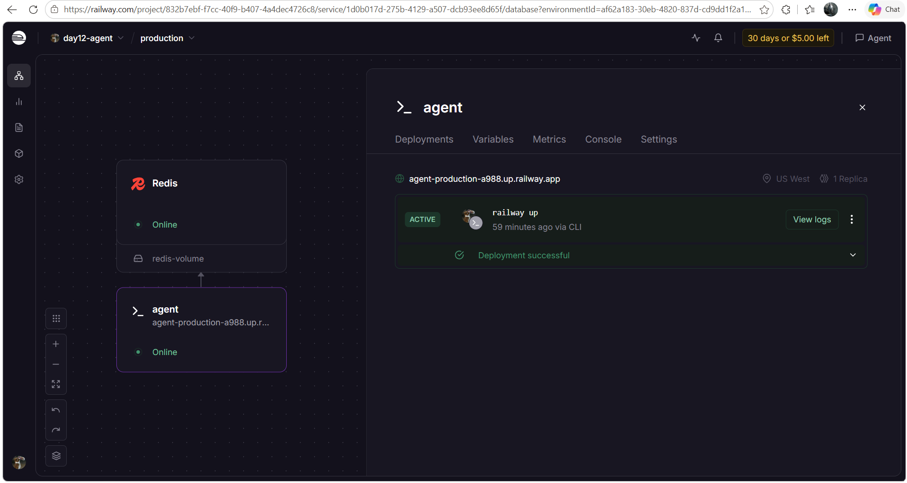
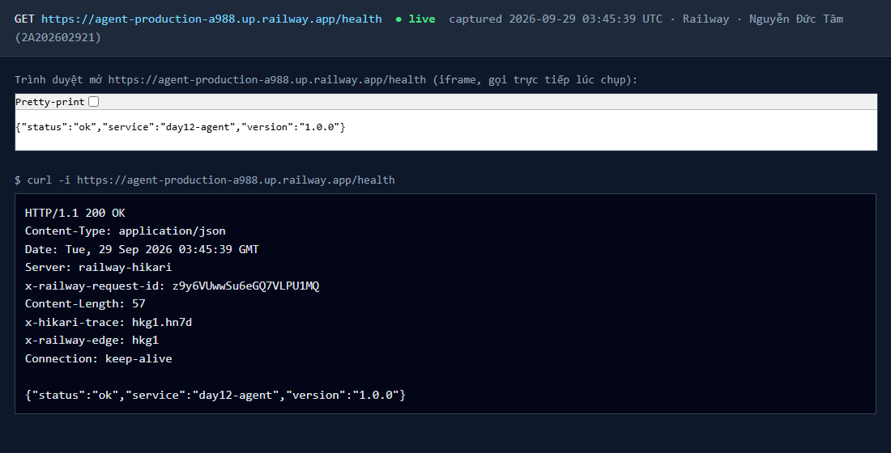

# Thông Tin Deploy — Checkpoint 5

> Điền file này sau khi deploy xong. `pytest tests/test_cp5.py` đọc file này
> để tìm địa chỉ service của bạn và gọi thử.
>
> **Chỉ ghi TÊN biến môi trường, tuyệt đối không dán giá trị API key vào đây.**
> Repo này công khai — dán khóa vào là mất khóa.

## Thông Tin Học Viên

| Mục | Nội dung |
|-----|----------|
| Họ và tên | Nguyễn Đức Tâm |
| Mã học viên | 2A202602921 |
| Repo | https://github.com/tamnd2004/K4-L3B-DAY12-NguyenDucTam-2A202602921-CloudServicesAndDeployment |

## Service

| Mục | Nội dung |
|-----|----------|
| Public URL | https://agent-production-a988.up.railway.app |
| Platform | Railway (project `day12-agent`, service `agent` build từ `Dockerfile`, database `Redis`) |
| Ngày deploy | 2026-09-29 |

## Biến Môi Trường Đã Set Trên Cloud

Ghi tên biến và **nguồn giá trị**, không ghi giá trị:

| Biến | Đã set | Ghi chú |
|------|--------|---------|
| `PORT` | ✅ | platform tự gán (Railway cấp 8080 — log: `Uvicorn running on http://0.0.0.0:8080`) |
| `AGENT_API_KEY` | ✅ | khóa ngẫu nhiên riêng cho cloud, set qua `railway variables --set-from-stdin`, không nằm trong repo |
| `REDIS_URL` | ✅ | Redis add-on của Railway, tham chiếu `${{Redis.REDIS_URL}}` (private network `redis.railway.internal:6379`) |
| `RATE_LIMIT_PER_MINUTE` | ✅ | 10 |
| `MONTHLY_BUDGET_USD` | ✅ | 10.0 |
| `LOG_LEVEL` | ✅ | INFO |

## Lệnh Kiểm Tra

Thay `<URL>` bằng Public URL ở trên:

```bash
# 1. Liveness — mong đợi 200 {"status":"ok"}
curl -i <URL>/health

# 2. Readiness — mong đợi 200 {"status":"ready"} (đã nối được Redis)
curl -i <URL>/ready

# 3. Không có API key — mong đợi 401
curl -i -X POST <URL>/ask \
  -H "Content-Type: application/json" \
  -d '{"question":"Hello"}'

# 4. Có API key — mong đợi 200 kèm câu trả lời
curl -i -X POST <URL>/ask \
  -H "Content-Type: application/json" \
  -H "X-API-Key: $AGENT_API_KEY" \
  -H "X-User-Id: sv-test" \
  -d '{"question":"Deploy là gì?"}'

# 5. Rate limit — gọi 15 lần, những lần cuối phải trả 429
for i in $(seq 1 15); do
  curl -s -o /dev/null -w "%{http_code} " -X POST <URL>/ask \
    -H "Content-Type: application/json" \
    -H "X-API-Key: $AGENT_API_KEY" \
    -H "X-User-Id: sv-test" \
    -d '{"question":"test"}'
done; echo
```

## Kết Quả Chạy Thật

Chạy lúc 2026-09-29 ~03:44 UTC với `URL=https://agent-production-a988.up.railway.app`
(chỉ giữ lại status line, `Content-Type` và body; key được đọc từ biến môi trường, không in ra):

```
$ curl -i $URL/health
HTTP/1.1 200 OK
Content-Type: application/json
{"status":"ok","service":"day12-agent","version":"1.0.0"}

$ curl -i $URL/ready
HTTP/1.1 200 OK
Content-Type: application/json
{"status":"ready","redis":true}

$ curl -i -X POST $URL/ask -H "Content-Type: application/json" -d '{"question":"Hello"}'
HTTP/1.1 401 Unauthorized
Content-Type: application/json
{"detail":"invalid or missing API key"}

$ curl -i -X POST $URL/ask -H "Content-Type: application/json" -H "X-API-Key: $AGENT_API_KEY" -H "X-User-Id: sv-test" -d '{"question":"Deploy là gì?"}'
HTTP/1.1 200 OK
Content-Type: application/json
{"answer":"Câu hỏi hay. Deploy là gì thường được giải quyết bằng cách chuẩn hóa môi trường chạy: cùng một image chạy giống nhau ở laptop và trên cloud.","user_id":"sv-test","history_length":0,"cost_usd":2.145e-05,"tokens":{"in":3,"out":35}}

$ for i in $(seq 1 15); do curl ... /ask (X-User-Id: sv-test); done
200 200 200 200 200 200 200 200 200 429 429 429 429 429 429
```

Lệnh 5 cho 9 lần `200` rồi `429`: lệnh 4 ngay trước đó đã dùng 1 lượt của
`sv-test`, nên request thứ 10 trong vòng lặp là request thứ 11 trong 60 giây.

Log trên Railway (`railway logs --service agent`) lúc khởi động — Railway đọc
được log JSON một dòng thành các field có cấu trúc:

```
INFO:     Started server process [1]
INFO:     Waiting for application startup.
[INFO]  event="service_started" timestamp="2026-09-29T03:43:44.269090+00:00" service="day12-agent" version="1.0.0"
INFO:     Application startup complete.
INFO:     Uvicorn running on http://0.0.0.0:8080 (Press CTRL+C to quit)
```

## Ảnh Chụp Màn Hình

Đặt ảnh trong thư mục `screenshots/`:

- `screenshots/dashboard.png` — trang quản lý service trên platform
- `screenshots/health.png` — kết quả gọi `/health` từ trình duyệt hoặc curl





## CI/CD (bonus)

`.github/workflows/ci.yml`: `test` (pytest, bỏ `test_cp5` và test build Docker) →
`build` (docker build + chạy thử container gọi `/health`) → `deploy`
(`railway up --service agent --ci`, chỉ trên nhánh `main`, chỉ sau khi hai job
trước xanh, token lấy từ GitHub Secret `RAILWAY_TOKEN`).
